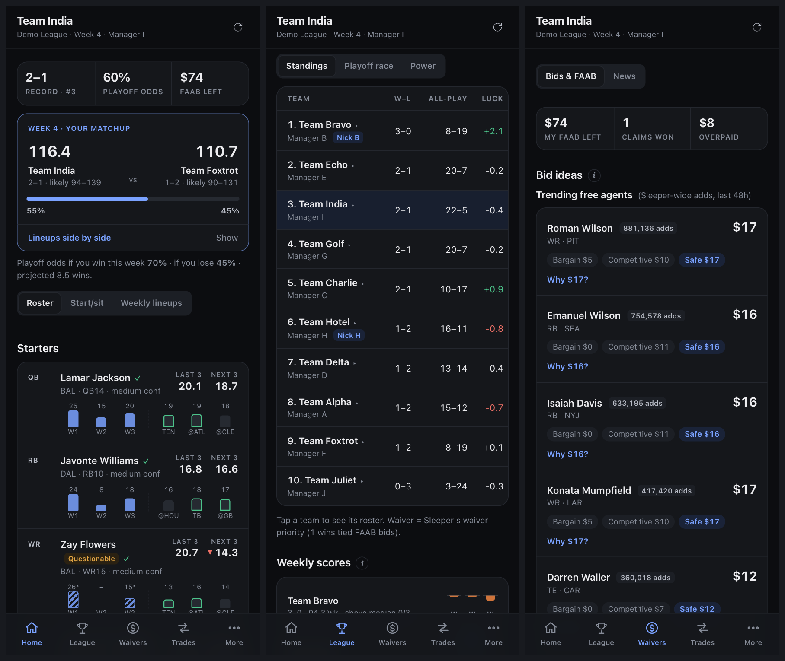
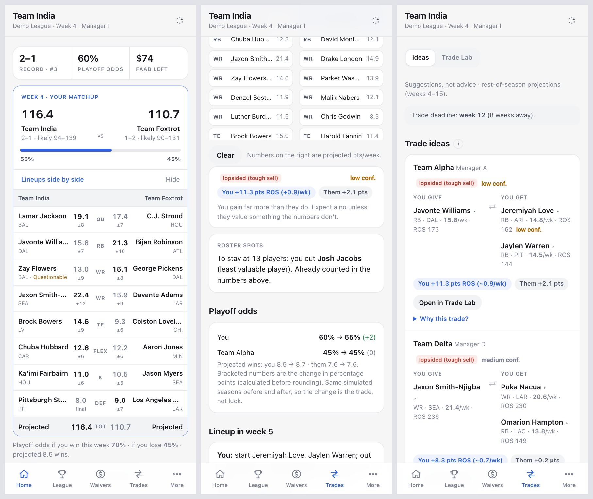

# Fantasy NFL Assistant

A fantasy football assistant for **any Sleeper league**. A Python pipeline pulls your
league from the public Sleeper API, **verifies** player points against a second source
([nflverse](https://github.com/nflverse/nflverse-data)), builds rest-of-season
projections, and publishes a mobile-friendly dashboard: matchups and win chances,
start/sit calls, playoff odds, FAAB bid ideas and rival bidders, trade ideas, and an
injury and opportunity scanner. It also writes a short verified brief to paste into an
AI assistant.

Free to run: public APIs only, no keys, no paid services. A clean, calm mobile design with a
bottom tab bar (Home · League · Waivers · Trades · More), automatic dark mode and installable
as a phone app.




*Screenshots use an anonymised demo league (`python -m nfl_assistant.anonymize`).*

## What it does

| Tab | What you get |
|---|---|
| **Home** | Everything about you: this week's matchup with projected scores, win chance and both lineups side by side, playoff odds with a trend line, if-you-win / if-you-lose odds, alerts, then a toggle for **Roster** (last 3 vs next 3 weeks per player, tap for details), **Start/sit** and **Weekly lineups** (byes included), plus your key games. |
| **League** | A toggle for **Standings** (with all-play record and luck; tap a team to see its roster), **Playoff race** (odds from 10,000 simulated seasons, trend, other games to watch) and **Power** rankings; a weekly scores chart (each week vs the league median); and all of this week's matchups. |
| **Waivers → News** | Only what changed since the last run: injuries, depth chart promotions, team changes and fresh drops, split into *my players*, *other teams' starters* (trade openings) and *free agents worth a look* (with bid ideas and likely rival bidders). |
| **Waivers → Bids & FAAB** | Bid ideas at three levels (bargain / competitive / safe), likely rivals with a bid-to-win range, manager tendencies (style, positions chased, overpaying, budget), a full waiver log with runner-up bids, and market prices. |
| **Trades → Ideas** | Rest-of-season player values with range and confidence, value over replacement, mutual-benefit trade ideas with reasoning, buy-low / sell-high, and team strength vs the league median with a toggle: season so far (actual started lineups and lineup efficiency), projected, and a trade-partner snapshot (needs, playoff odds, trades made). Trade deadline countdown. Tap any player for the same details as the roster cards. |
| **Trades → Trade Lab** | Build any trade with any team and get a full breakdown: rest-of-season gain for both sides, playoff odds before → after, week-by-week impact (byes included), lineup changes, positional strength, and the players' details. Runs in the browser, instantly. |
| **More → Planner** | Forecast any remaining week: swap bench players in, see your projected score vs the best possible and your win chance, and plan waiver pickups (with drops) to see the week-by-week, rest-of-season and playoff-odds impact. Saved on your device. |
| **More → Brief** | `claude_brief.md`: a compact verified summary with a one-tap Copy button. |

## Use it with your league

### On your computer

Requires [uv](https://docs.astral.sh/uv/), which installs the right Python automatically.

```bash
git clone https://github.com/<you>/fantasy-nfl-assistant.git
cd fantasy-nfl-assistant
cp config.example.yaml config.yaml   # then edit: league_id, username, timezone
uv run python -m nfl_assistant.run   # fetch, verify, project, build site/data/
open site/index.html                 # view it (works straight from disk)
```

**On a Mac without the terminal:** after the one-time setup above, double-click
**`Update Dashboard.command`** in the project folder (or a Desktop shortcut to it). It
refreshes your data and opens the dashboard. If macOS blocks it the first time,
right-click it → **Open**.

Your league ID is in the Sleeper web app's URL: `sleeper.com/leagues/<LEAGUE_ID>/...`.
`config.yaml` is git-ignored, and so are all generated data and snapshots.

### Automatically on GitHub (Tuesday + Friday, plus a "Run workflow" button)

1. Fork or copy this repo.
2. **Settings → Secrets and variables → Actions → Variables**: add `LEAGUE_ID` and
   `SLEEPER_USERNAME`. Optional: `LEAGUE_TIMEZONE` (e.g. `America/New_York`),
   `NICKNAMES` (`user=Nick,user2=Nick2`), `TARGETS` (`Player One;Player Two`).
3. **Settings → Pages → Source: GitHub Actions**.
4. **Actions → Tests, data update and site deploy → Run workflow**.

Without `LEAGUE_ID` set, the workflow only runs tests, so nothing is ever published by
accident. League data is never committed; snapshots are kept in the Actions cache.

> **Privacy:** a Pages site is public to anyone with the link, and on a public repo so are
> the Actions logs. To keep your league private, run it in a **private** repo (free
> Actions minutes easily cover it) and view the site locally or behind an access-controlled
> host, or just run it on your own computer.

The schedule (`0 8 * * 2,5`, 08:00 UTC Tue + Fri) lands after Monday and Thursday night
games all season. Change the cron in `.github/workflows/update.yml` to suit your timezone.

## Install it as an app on your phone

Once the site is hosted on https (GitHub Pages, Cloudflare, etc.) it installs like an app,
with its own icon, full screen, and offline viewing of the last update:

- **Android (Chrome):** tap **Install** in the dashboard's header (or menu → *Install app*).
- **iPhone (Safari):** Share → **Add to Home Screen**.

Offline support needs a real web address, so it isn't active when you open
`site/index.html` straight from disk. Everything else works there.

## How it works

```
uv run python -m nfl_assistant.run
  ├─ Sleeper API ──── league, rosters, users, matchups (incl. future pairings), transactions, trending, players
  ├─ nflverse ─────── weekly stats (this + last season), snap counts, schedule with byes and Vegas lines
  ├─ dashboard.py ─── standings, rosters, season points, IR eligibility
  ├─ nflverse.py ──── recompute points with league scoring → verified / unverified
  ├─ projections.py ─ rest-of-season projections with ranges and confidence
  ├─ lineups.py ───── optimal lineup for every week (byes, injuries)
  ├─ outlook.py ───── win chances, start/sit, playoff simulation
  ├─ trades.py ────── trade values and mutual-benefit ideas
  ├─ faab.py / tendencies.py ── bid ideas, rivals, manager habits
  ├─ scanner.py ───── what changed since the last snapshot
  ├─ brief.py ─────── claude_brief.md
  └─ site/data/*.json + *.js  ──► static site (plain HTML/CSS/JS, no build step)
```

Design decisions:

- **Trustworthy numbers first.** Displayed points come only from Sleeper's league-scored
  matchup data and are cross-checked against nflverse. Projections show a range and a
  confidence label, and odds are rounded to 5% until there's enough data.
- **One projection engine.** Last season, this season and usage (targets, carries,
  attempts) are blended, and injury-shortened games are left out using snap counts.
  Next week's matchup comes from Vegas lines, and byes and injury designations are
  applied week by week. Trades, lineups, win chances, playoff odds and FAAB rivals all
  build on it.
- **The lowest bid that would have won.** Failed waiver claims reveal runner-up bids,
  which gives the real "clearing price" behind bargain-first bid suggestions.
- **Trades both sides would accept.** A trade is only suggested if it improves *both*
  teams' optimal lineups over the rest of the season.
- **Polite to APIs**, and it **works offline**: data is written as `.js` too, so the site
  opens from disk.

## Development

```bash
uv run pytest                              # offline tests using sample data
uv run python -m nfl_assistant.anonymize   # demo/ copy with league names replaced
```

See [AGENTS.md](AGENTS.md) for architecture, model details and conventions.

## Tech

Python 3.12 · uv · httpx · PyYAML · pytest · vanilla HTML/CSS/JS · GitHub Actions ·
GitHub Pages.

*All suggestions are heuristics, not advice.*
